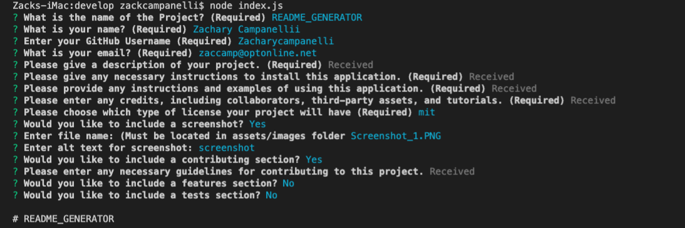

# README_Generator
  
## Description 

  
A good, quality README is crucial to make any project stand out, as well as to ensuring the user is able to run the application correctly. This command-line app uses Node.js to dynamically create a README file based on user input. Check out [README_GENERATOR.MD](dist/assets/README_GENERATOR.md) to see this README created through this application.

## Table of Contents
* [Installation](#Installation)
* [Usage](#Usage)
* [License](#License)
* [Credits](#Credits)
* [Contributing](#Contributing)
* [Questions](#Questions)

## Installation
To generate your README, `git clone` this repository to your local computer. Then run `npm install` in order to install the npm package dependencies.

  
## Usage
Run `node index.js` from the command line and answer the prompts to generate your README. Your README file will be named 'title'.md, where 'title' is the response you give to the corresponding question, the title of the project. The file will be written into the `dist` folder.
For any prompts that may require more than one line of text, a separate editor is opened. You may enter your answers here, and when finished you may save and exit the editor by pressing:
1. Escape
2. : (colon)
3. wq (w = save, q = quit)
4. Enter

## License
A short and simple permissive license with conditions only requiring preservation of copyright and license notices. Licensed works, modifications, and larger works may be distributed under different terms and without source code.  
  
## Credits
Tutorials:  
-[Inquirer Tutorial](https://pakstech.com/blog/inquirer-js/)

  
## Contributing
1. Create a fork
2. Clone your fork of the repository to your local machine
3. Create a branch to work off of
4. Commit changes in this branch
5. Push the branch to your fork on GitHub
6. Submit a pulll requet from that branch to the original repository 

## Questions
If you have any questions, concerns, or comments, feel free to contact me:
  
-GitHub: [Zacharycampanelli](https://github.com/Zacharycampanelli)  
-Email: [zaccamp@optonline.net](mailto:zaccamp@optonline.net)
